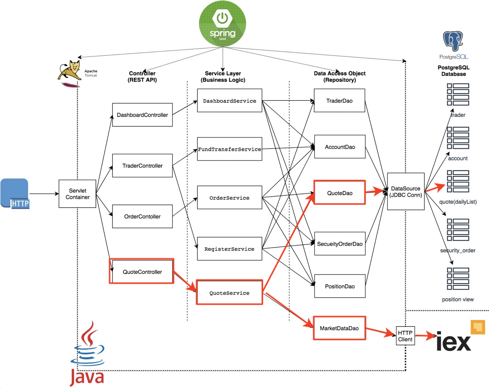
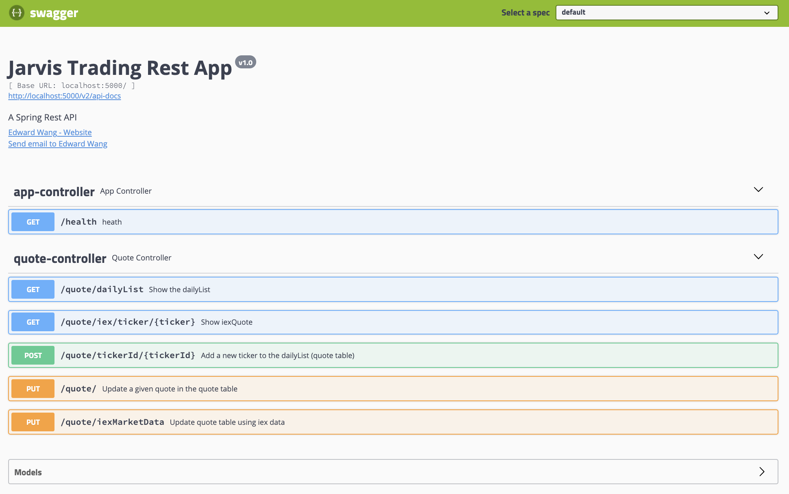
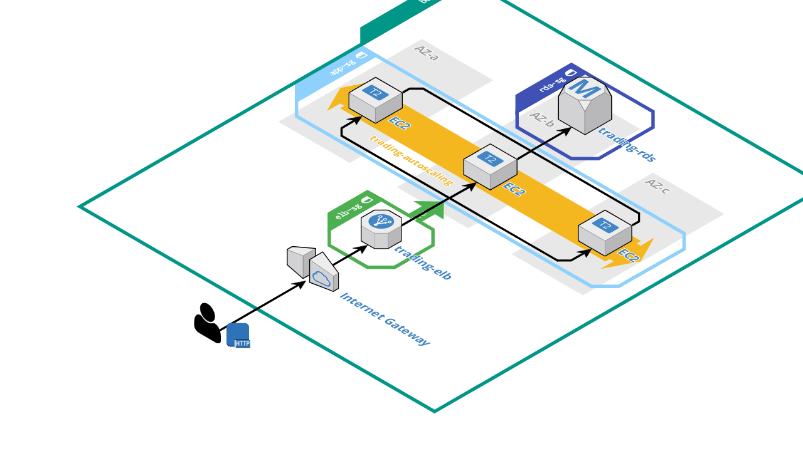
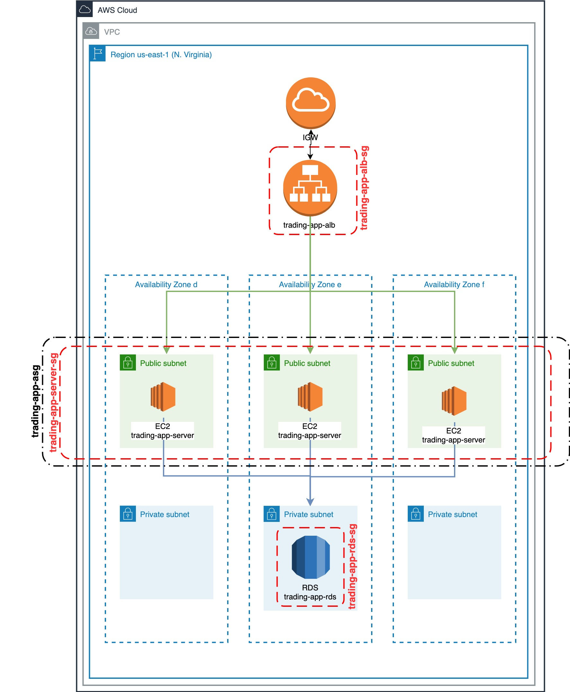

# `trading_app` Demo project

This project only keeps the red component in the diagram below for demo and cloud deployment learning purpose.



# Quicker Start

**Prerequisites:**

* Docker (17.05 or higher which support multi-stage build)
* IEX token for getting market data (`https://iexcloud.io/docs/api/`) 

**Commands**

```bash
#you may or may not need sudo for docker cmds

#start docker
sudo systemctl start docker
#17.05 or higher
sudo docker -v

#create network bridge between SpringBoot app and postgreSQL
sudo docker network create --driver bridge trading-net

#build trading app
sudo docker build -t trading-app .

#build psql image
cd psql/
sudo docker build -t jrvs-psql .

#run a psql container
sudo docker run --rm --name jrvs-psql \
-e POSTGRES_PASSWORD=password \
-e POSTGRES_DB=jrvstrading \
-e POSTGRES_USER=postgres \
--network trading-net \
-d -p 5432:5432 jrvs-psql

#Setup IEX token
IEX_TOKEN='your_IEX_token'
#run a trading_app container
sudo docker run \
-e "PSQL_URL=jdbc:postgresql://jrvs-psql:5432/jrvstrading" \
-e "PSQL_USER=postgres" \
-e "PSQL_PASSWORD=password" \
-e "IEX_PUB_TOKEN=${IEX_TOKEN}" \
--network trading-net \
-p 5000:5000 -t trading-app

#verify health
curl localhost:5000/health
#verify Swagger UI from your browser
localhost:5000/swagger-ui.html

```

**Swagger-UI page**



# Cloud Deployment

## 3D Architecture Diagram




## Detailed Architecture Diagram

